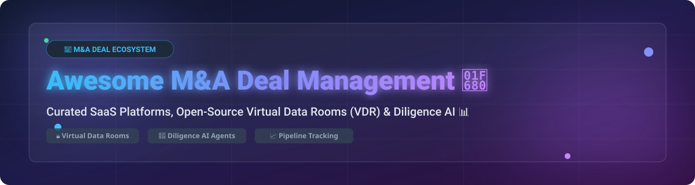

  

# 🚀 Awesome M&A Deal Management Ecosystem 💼

  
  
  
  
  

## 📌 Top Mergers & Acquisitions (M&A) Deal Management & Virtual Data Room (VDR) Ecosystem 📊

> **Curated List of Commercial SaaS Platforms & Open-Source GitHub Repositories**  
> *Focused on Virtual Data Rooms (VDR), Due Diligence Workflows, Deal Pipeline Management, Secure Document Sharing & Transaction Lifecycle Automation.*  
> **Last updated: September 2026** 📅

---

## 📖 Overview & SEO Summary 🔍

This repository serves as a comprehensive, SEO-optimized directory of top-tier **SaaS platforms** and **open-source software** engineered for **M&A Deal Management**, **Virtual Data Rooms (VDR)**, and **Corporate Development (CorpDev)** workflows. 

These software solutions empower investment bankers, private equity (PE) firms, venture capital (VC) funds, legal advisors, and corporate strategy teams to:
- 🔒 **Secure Confidential Documents**: Granular permissioning, dynamic watermarking, DRM, and immutable audit logs.
- 📋 **Automate Due Diligence**: Centralized request lists (RFI), automated Q&A tracking, and AI-powered contract analysis.
- 🤝 **Manage Buyer Engagement**: Real-time heatmaps, document viewing analytics, and interest scoring.
- 🔄 **Orchestrate Full Deal Lifecycles**: Deal sourcing, pipeline CRM, negotiation, closing, and post-merger integration (PMI).

---

## 📑 Table of Contents
- [📊 SaaS & Hosted Commercial Platforms](#-saas--hosted-commercial-platforms)
- [💻 Open-Source GitHub Repositories](#-open-source-github-repositories)
- [🤝 How to Contribute](#-how-to-contribute)
- [💖 Support & Sponsorship](#-support--sponsorship)
- [⚠️ Disclaimer & Security Guidelines](#%EF%B8%8F-disclaimer--security-guidelines)
- [📈 Star History](#-star-history)

---

## 📊 SaaS & Hosted Commercial Platforms 🏢

> **Market Analysis & Industry Structure** 💡  
> The global Virtual Data Room (VDR) and M&A deal management software market is estimated at **$2.2 Billion to $2.5 Billion USD** (with projections reaching ~$4.8B by 2030 at a CAGR of ~13.5%). The market is **moderately fragmented**: enterprise high-stakes mega-cap transactions are heavily concentrated among legacy market leaders (SS&C Intralinks, Datasite), while mid-market deals, growth equity, and specialized deal sourcing are served by an expanding wave of modern agile SaaS providers (DealRoom, Ansarada, Firmex, DealCloud, Affinity).

Below is a comparison of top commercial M&A deal platforms, ordered by estimated company size (valuation / annual revenue descending):

| Platform 🌐 | Description 📝 | Company Size / Revenue / Valuation 💰 | Starting Pricing 🏷️ | Free Tier / Trial Limit 🎁 |
| :--- | :--- | :--- | :--- | :--- |
| **[Intralinks (SS&C)](https://www.intralinks.com/)** 🏢 | Enterprise-grade VDR and deal execution platform with institutional security and regulatory compliance. | **~$450M Revenue** (Division of SS&C Technologies, $15B+ Market Cap) | **$250/month** (Basic VDR project tier) | **14-day free trial** (up to 1 GB storage & 5 users) |
| **[Datasite](https://www.datasite.com/)** ⚡ | Premier VDR and deal platform featuring AI document redacting and automated diligence workflows. | **~$400M Revenue** (Acquired by CapVest for ~$1.5B) | **$1,500/deal/month** (Flat-rate deal package) | **14-day free trial** (Demo sandbox with sample data room) |
| **[Affinity](https://www.affinity.co/)** 🤝 | Relationship intelligence CRM and deal sourcing platform for PE, VC, and M&A advisors. | **$600M Valuation** (~$50M ARR, $120M+ raised) | **$2,000/user/year** (Standard tier) | **14-day free trial** (Full feature access upon request) |
| **[DealCloud](https://www.dealcloud.com/)** ☁️ | Institutional deal management, pipeline CRM, and corporate development platform by Intapp. | **~$350M Parent Revenue** (Intapp NASDAQ: INTA, ~$2.8B Market Cap) | **$125/user/month** (Billed annually, min. seat requirement) | **7-day guided trial** (Available via sales demo) |
| **[Ansarada](https://www.ansarada.com/)** 🤖 | AI-powered virtual data room, deal readiness, and bidder engagement scoring platform. | **~$236M Acquisition** (Acquired by Datasite / SmartStart) | **$399/month** (90-day small deal plan) | **14-day free trial** (Up to 250 MB data room storage) |
| **[Firmex](https://www.firmex.com/)** 🔒 | Reliable mid-market VDR popular for competitive auctions, corporate governance, and litigation. | **~$40M Revenue** (Acquired by Datasite / Citadel Software) | **$1,200/year** (Subscription model per data room) | **14-day free trial** (Full administrative privileges) |
| **[SourceScrub](https://www.sourcescrub.com/)** 🔎 | M&A deal sourcing, boot-strapped company intelligence, and pipeline enrichment engine. | **~$30M Revenue** (Backed by Francisco Partners) | **$600/user/month** (Enterprise annual contract) | **7-day trial limit** (Restricted search queries) |
| **[DealRoom](https://dealroom.net/)** 🎯 | Agile M&A lifecycle platform integrating pipeline CRM, diligence request lists, and VDR. | **~$15M Revenue** (Bootstrapped / Growth Stage) | **$1,250/month** (Single deal package including unlimited users) | **14-day free trial** (Full access to VDR and Diligence boards) |
| **[Midaxo](https://www.midaxo.com/)** 🔄 | Corporate development and post-merger integration (PMI) playbook management platform. | **~$10M Revenue** (Venture Backed) | **$800/month** (Starter pipeline tier) | **14-day free trial** (Access to M&A playbooks & pipeline) |

---

## 💻 Open-Source GitHub Repositories 🔓

> **Open-Source Ecosystem Overview** 🛠️  
> While enterprise high-stakes transaction rooms often utilize commercial SaaS for legal defensibility and SOC 2 Type II compliance, open-source technology is rapidly transforming document security, self-hosted data rooms, and AI forensic due diligence. Below is a curated list of top open-source projects ranked by GitHub Stars_Count:

| Repository 📦 | GitHub_Stars ⭐ | Description 📝 | Primary Use Case 🛠️ |
| :--- | :--- | :--- | :--- |
| **[Nextcloud Server](https://github.com/nextcloud/server)** ☁️ |  | Self-hosted enterprise content platform with granular access controls, encryption, and audit logs configurable as a secure VDR. | Self-Hosted File Storage & VDR |
| **[Hoppscotch](https://github.com/hoppscotch/hoppscotch)** 🚀 |  | Open-source API development suite used for building custom M&A workflow integrations and deal pipeline APIs. | Custom M&A API Integration |
| **[Twenty CRM](https://github.com/twentyhq/twenty)** 💼 |  | Modern open-source CRM platform providing full control over deal pipeline management, contact tracking, and custom deal stages. | M&A Pipeline & Sourcing CRM |
| **[Activepieces](https://github.com/activepieces/activepieces)** ⚡ |  | Open-source no-code workflow automation tool connecting CRM, VDR notifications, and email alerts across deal cycles. | Deal Workflow Automation |
| **[Documenso](https://github.com/documenso/documenso)** ✍️ |  | Open-source digital signature infrastructure for signing NDAs, definitive agreements, and closing documents. | M&A Document Signing & NDAs |
| **[Papermark](https://github.com/mfts/papermark)** 📄 |  | Open-source document sharing & virtual data room (DocSend alternative) with link tracking, custom branding, and page-level analytics. | Open Virtual Data Room & Analytics |
| **[ownCloud Core](https://github.com/owncloud/core)** 🗄️ |  | Open-source content collaboration platform providing secure file sync, file locking, and self-hosted data room capabilities. | Secure Document Repository |
| **[CryptPad](https://github.com/cryptpad/cryptpad)** 🔐 |  | Zero-knowledge end-to-end encrypted collaboration suite for private deal notes, secret document sharing, and real-time collaboration. | Encrypted Diligence Collaboration |
| **[Due Diligence Agents](https://github.com/zoharbabin/due-diligence-agents)** 🤖 |  | Multi-agent AI framework for automated forensic due diligence across legal, financial, tech, HR, and tax documents with cited findings. | AI Forensic Due Diligence |
| **[Coneshare](https://github.com/coneshare/coneshare)** 🛡️ |  | Self-hosted virtual data room layer adding engagement tracking, access permissions, and watermark overlays on top of existing storage. | Self-Hosted VDR Overlay |
| **[ONLYOFFICE DocSpace Server](https://github.com/ONLYOFFICE/DocSpace-server)** 👥 |  | Room-based collaboration server featuring custom Data Room rooms with fine-grained access control and document co-editing. | Secure Room-Based Document Sharing |
| **[OpenGP](https://github.com/vivan1211/opengp)** 📊 |  | AI intelligence platform tailored for Private Equity and M&A deal teams featuring RAG chat over VDR files and portfolio analytics. | PE Data Room RAG & Analytics |

---

## 🛠️ Key Architectural Building Blocks for Custom VDRs 🏗️

Teams building custom self-hosted transaction infrastructure often combine multiple open-source layers:
- 🔒 **Storage & Permission Core**: Hardened [Nextcloud](https://github.com/nextcloud/server) or [ownCloud](https://github.com/owncloud/core) with watermarking and audit logs.
- 📄 **Sharing & Analytics Engine**: [Papermark](https://github.com/mfts/papermark) or [Coneshare](https://github.com/coneshare/coneshare) for link-based document tracking.
- 🤖 **AI Forensic Analysis**: [Due Diligence Agents](https://github.com/zoharbabin/due-diligence-agents) or [OpenGP](https://github.com/vivan1211/opengp) for RAG querying across data room archives.
- ✍️ **Closing & E-Signatures**: [Documenso](https://github.com/documenso/documenso) for NDA execution and final closing binder approvals.

---

## 🤝 How to Contribute 💡

We welcome contributions from corporate development professionals, M&A advisors, and open-source maintainers! 🌟

1. 🍴 **Fork** this repository.
2. 📝 **Add/Update entries** in `README.md` following the tabular layout.
3. 🔍 Ensure accurate pricing, company metrics, repository Stars_Badges, and links.
4. 🚀 **Submit a Pull Request** with a brief summary of additions.

---

## 💖 Support & Sponsorship 🙏

Thank you for visiting and supporting the **Awesome M&A Deal Management Ecosystem** repository! 🌟

If you find this curated list valuable for your M&A workflows, corporate development research, or private equity tech stack, please consider supporting the project:

- ⭐ **Star this repository** to help others discover it on GitHub!
- 🍴 **Fork and share** it with your colleagues, deal teams, and developer community.
- ☕ **Buy me a coffee / Sponsor**: If you'd like to support ongoing maintenance and new features, consider sponsoring via the [GitHub Sponsor Dashboard](https://github.com/sponsors/ishandutta2007).

Your support is greatly appreciated and helps keep this list up to date! ❤️

---

## ⚠️ Disclaimer & Security Guidelines 🛡️

- ⚖️ *This list is community-curated for informational and research purposes only. Inclusion does not constitute a formal endorsement.*
- 🔒 *M&A transactions involve highly confidential, price-sensitive material (MNPI) and legally privileged data. Ensure any VDR deployed adheres to strict compliance mandates (SOC 2 Type II, ISO/IEC 27001, GDPR, and HIPAA).*
- 💻 *Self-hosted open-source software places complete responsibility for encryption at rest/transit, access revocation, dynamic watermarking, and legal defensibility on the self-hosting team.*

---

## 📈 Star History

---

  <b>Built with ❤️ for Corporate Development Teams, Private Equity, Investment Bankers & Deal Technologists.</b>

